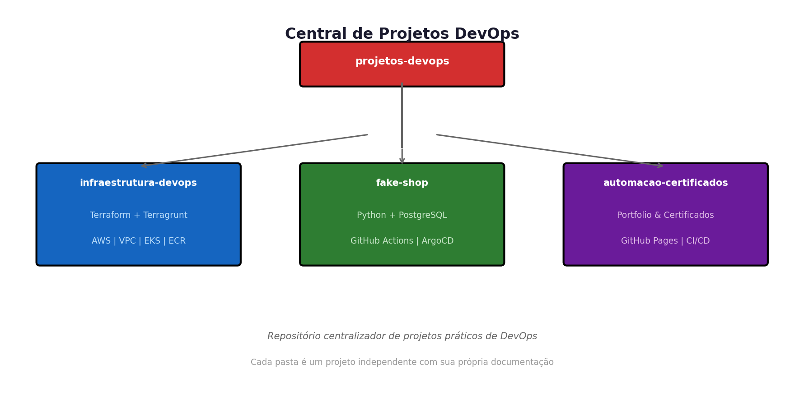
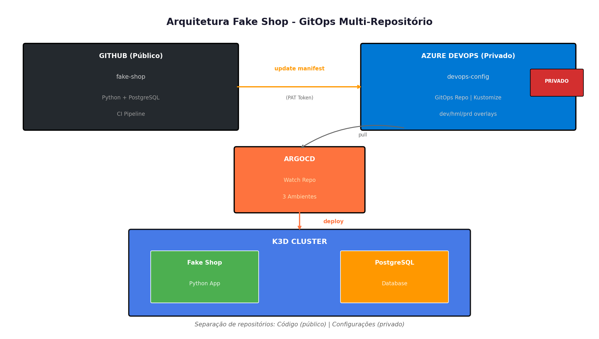

# Projetos DevOps

Central de projetos práticos de infraestrutura, automação e CI/CD.

## Projetos

| Pasta | Descrição | Tecnologias |
|-------|-----------|-------------|
| [infraestrutura-devops](infraestrutura-devops/) | Infraestrutura AWS como código | Terraform, Terragrunt, VPC, EKS, ECR |
| [fake-shop](fake-shop/) | Aplicação Python com **GitOps Multi-Repo** | Python, PostgreSQL, GitHub Actions, ArgoCD |
| [automacao-certificados-portfolio](automacao-certificados-portfolio/) | Automação de portfolio | GitHub Pages, CI/CD |

## Destaque: Arquitetura Multi-Repositório

O projeto **fake-shop** implementa uma arquitetura enterprise com separação de responsabilidades:

**Características:**
- **Repositório Público (GitHub)**: Código fonte e CI pipeline
- **Repositório Privado (Azure DevOps)**: Manifests Kubernetes e configurações sensíveis
- **GitOps**: ArgoCD sincroniza automaticamente 3 ambientes (dev/hml/prd)
- **Segurança**: Configurações isoladas do código fonte

## Objetivo

Demonstrar skills práticas em:
- Infrastructure as Code (IaC)
- CI/CD pipelines
- GitOps e separação de repositórios
- Cloud (AWS)
- Kubernetes

## Autor

**Adriano Matildes** | DevOps Engineer  
[LinkedIn](https://linkedin.com/in/adrianomatildes) | [GitHub](https://github.com/adrianomatildes)