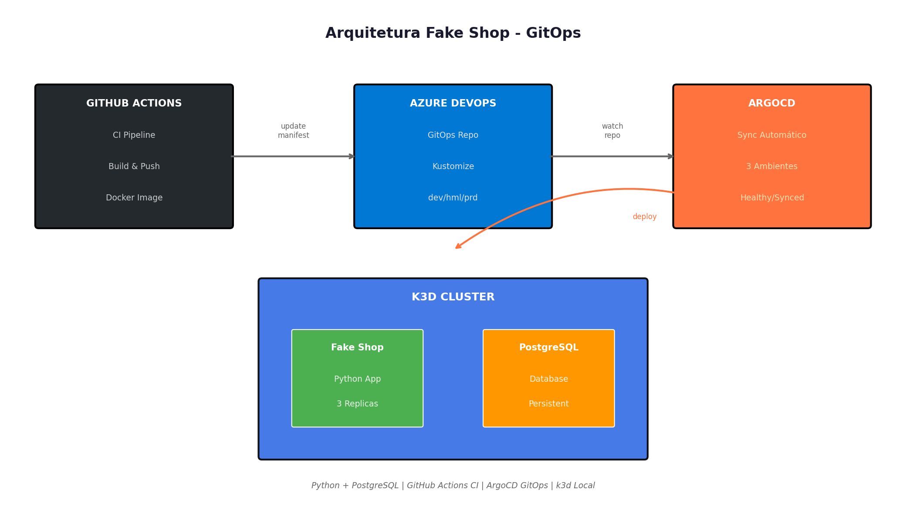
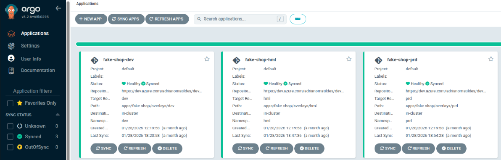

# Fake Shop

Aplicação Python com PostgreSQL, CI/CD GitHub Actions e GitOps ArgoCD.

## Stack

| Componente | Tecnologia |
|------------|------------|
| App | Python (Flask) |
| Banco | PostgreSQL |
| CI/CD | GitHub Actions |
| GitOps | ArgoCD |
| Cluster | k3d (local) |
| Manifests | Azure DevOps |

## Fluxo

1. Push para `dev`, `hml` ou `prd`
2. GitHub Actions builda e pusha imagem Docker
3. Pipeline atualiza manifest no Azure DevOps
4. ArgoCD detecta mudança e faz deploy no k3d

## Resultado

3 ambientes (dev/hml/prd) rodando no ArgoCD:

Status: **Healthy** | **Synced**

## Estrutura

fake-shop/
├── src/                    # Código Python
├── .github/workflows/      # CI/CD
├── postgres/              # Config DB
└── README.md

## ArgoCD

- **3 ambientes**: dev, hml, prd
- **Sync automático** via ApplicationSet
- **Status**: Healthy/Synced

## Autor

**Adriano Matildes** | DevOps Engineer  
[LinkedIn](https://linkedin.com/in/adrianomatildes) | [GitHub](https://github.com/adrianomatildes)