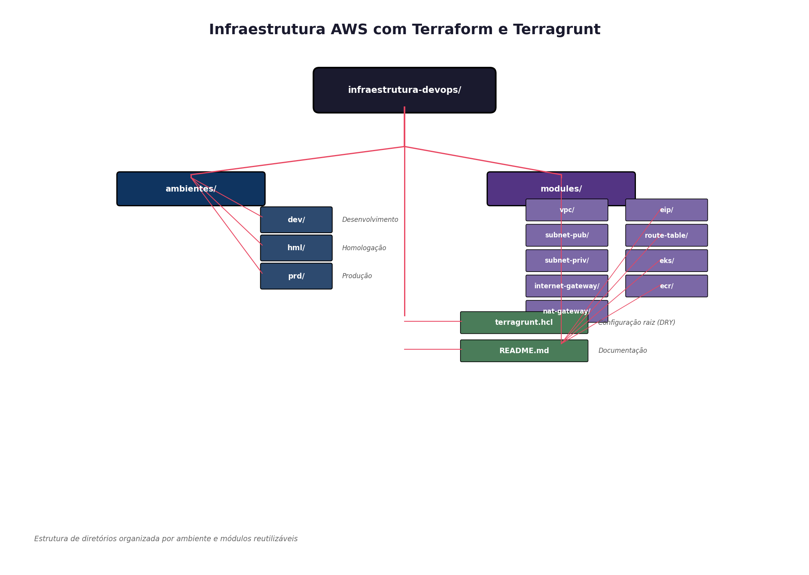
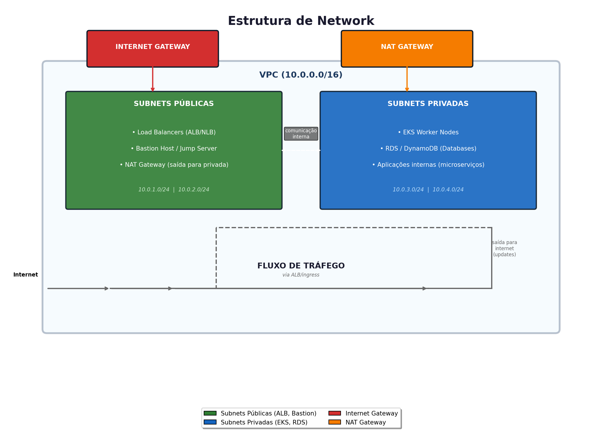

# Infraestrutura AWS com Terraform e Terragrunt

Arquitetura de Infrastructure as Code (IaC) multi-ambiente, utilizando Terraform e Terragrunt para provisionamento automatizado, escalável e seguro na AWS.

---

## Visão Geral

Este projeto implementa uma arquitetura cloud completa seguindo as melhores práticas de DevOps:

- **DRY (Don't Repeat Yourself)**: Configurações reutilizáveis via Terragrunt
- **Multi-ambiente**: Separação completa entre dev, homologação (hml) e produção (prd)
- **State Management**: Backend S3 com DynamoDB para locking
- **Modularização**: Módulos Terraform reutilizáveis e versionados
- **Segurança**: Princípio do menor privilégio e network isolation

---

## Arquitetura da Infraestrutura



Estrutura de diretórios organizada por ambiente e módulos reutilizáveis.

---

## Stack Tecnológico

| Componente | Tecnologia | Propósito |
|------------|------------|-----------|
| Orquestração | Terragrunt | Gerenciamento DRY de múltiplos ambientes |
| IaC | Terraform | Provisionamento de infraestrutura |
| Container Orchestration | Amazon EKS | Kubernetes gerenciado |
| Registry | Amazon ECR | Armazenamento de imagens Docker |
| Network | VPC, Subnets, IGW, NAT | Isolamento e conectividade |
| State Backend | S3 + DynamoDB | Persistência e locking de estado |

---

## Estrutura de Network



Arquitetura de network com VPC isolada, subnets públicas para exposição externa e privadas para workloads seguros.


---

## Como Executar

### Pré-requisitos

- AWS CLI configurado
- Terraform >= 1.5.0
- Terragrunt >= 0.50.0

### Deploy por Ambiente

```bash
# Desenvolvimento
cd ambientes/dev
terragrunt init
terragrunt plan
terragrunt apply

# Homologação
cd ../hml
terragrunt apply

# Produção
cd ../prd
terragrunt apply

```

### Deploy em Todos os Ambientes
```bash
terragrunt run-all apply --terragrunt-working-dir ambientes/
```
### Decisões Técnicas

### Por que Terragrunt?
- Herança de Configurações: Define backend S3 uma única vez no terragrunt.hcl raiz
- DRY: Elimina duplicação de código entre ambientes
- Isolamento: States separados por ambiente prevenindo conflitos
- Hooks: Permite execução de scripts pre/post-terraform

### Modularização Granular

A estrutura segue o padrão Micro-stacks:

- Cada recurso AWS é um módulo independente
- Permite reuso e testabilidade
- Facilita manutenção e evolução da infraestrutura

### Segurança

- Network Segmentation: Separação clara entre público e privado
- State Isolation: Buckets S3 separados por ambiente
- Least Privilege: IAM roles específicos para EKS e ECR

### Fluxo de Provisionamento

1. VPC: Criação da rede base e CIDR
2. Subnets: Divisão em públicas e privadas
3. Gateways: IGW para subnets públicas, NAT para privadas
4. Roteamento: Tabelas de rotas e associações
5. EKS: Cluster Kubernetes em subnets privadas
6. ECR: Registry para imagens de container

### Métricas do Projeto

| Aspecto                     | Implementação       |
| --------------------------- | ------------------- |
| Ambientes                   | 3 (dev, hml, prd)   |
| Módulos Reutilizáveis       | 12+                 |
| Redução de Código Duplicado | ~70%                |
| Isolamento de Network       | Completo (pub/priv) |
| Container Orchestration     | EKS gerenciado      |

'## Autor:'
### DevOps Engineer | AWS | Kubernetes | Terraform
